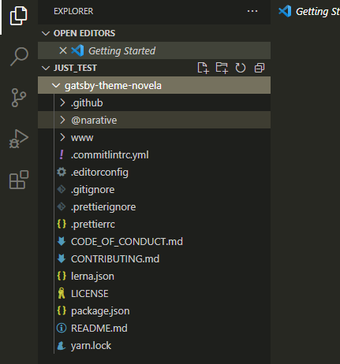
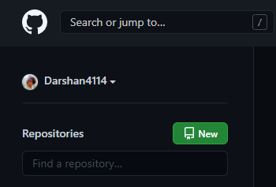
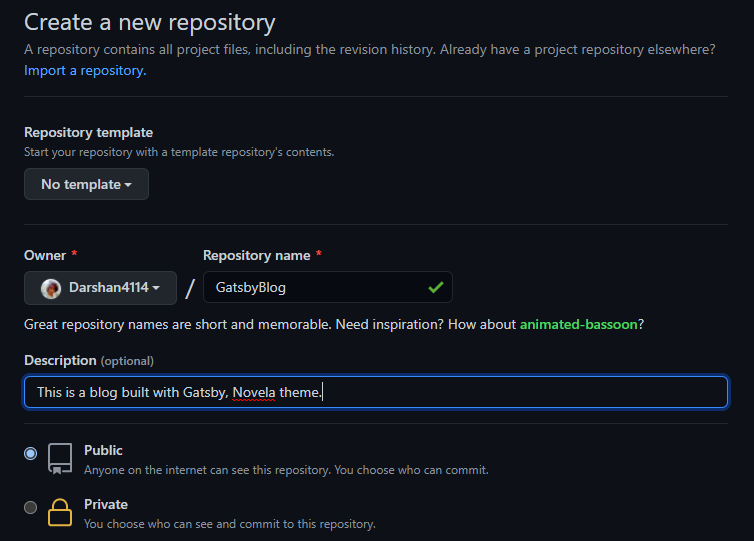
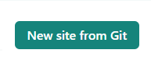

## Tools U+1F6E0:

1. Gatsby
2. Git and Github
3. VSCode
4. Markdown
5. Netlify

## Let's built a blog

### 1. Get a template

You don't need to know gatsby very well to start using it. There are hundreds of gatsby templates available for use, some officially from Gatsby and some from other 3rd party developers.
I am going to use the Novela gatsby theme from Narative.
Its free and open source, clone it from github.

```shell
git clone https://github.com/narative/gatsby-theme-novela.git
```

Now open the cloned folder in VSCode, (or your favorite code editor)
After you have opened the cloned folder, it should look something like this


** Open the terminal if not already open.( Shortcut: Ctrl + ~ )**

### 2. Push your code to github

> Git is a version control system, think of it like a log which stores all the changes made to your code.  
> Github is also a VCS(version control system) but on the cloud so that developers can share code.

_Initialize a git repository and make the first commit_

```shell
git init
git add .
git commit -m "initial commit"
```

_Create a repo on GitHub_




You can now add a name and description to your blog repository. Make it private/public.
Choose to add a readme, license, gitignore (optional)

Click create repository.

_Push code to GitHub_

Get the repository url. Its the url when you open the repository + ".git".
You can click on the Code button and copy the github repo link.
Now run these commands in the terminal
_Note: Replace <your_github_repo_url> with your repo url_

```shell
git branch -M main
git remote add origin <your_github_repo_url>
git push -u origin main
```

### 3. Create a netlify account

Create a netlify account and find this button "New site from git".



> Netlify might update their interface so, if you are reading this in future find out how to deploy a site from github. It will usually be a easy to find button

Login to github and deploy the repo.
Now netlify will give you a URL to the site and you can see your blog!

The rest of netlify things are really simple, their UI/UX is awesome.

You can go into the site settings and link the site to your own domain. I will make a blog about it soon :)

### 4. Add your author details to the blog

Open your blog code in VSCode.
And add the details like I have done here ->

### 5. Creating a blog post

Now whenever you want to publish a blog post, you add a index.md file to a well named folder in the posts folder.

_( or link the blog to **Contentful** or any other CMS, to get content from, again this is a topic I will surely blog on, but meanwhile, here's a link to learn how to link your gatsby blog to contentful: [Novela Theme Readme](https://github.com/narative/gatsby-theme-novela) . Check the readme its an awesome resource)_

> Here is a good resource to learn Markdown (.md) [Markdown Tutorial](https://www.markdowntutorial.com/)

Now once you have added the blog post you can run

```shell
gatsby develop
```

to see how it looks on your local server before publishing it.

When you are happy with how it looks you can make a git commit and push to github and deploy your site from netlify again.

> Pro Tip: Enable auto deploys in Netlify so you don't have to go to netlify everytime you want to deploy your site ??

### 6. Customizations

You can do a ton of stuff with your blog, you can use it to market yourself as a legit developer ??, help your fellow devs?? or sell your stuff ??
You are going to need a lot of plugins, you can use the novela theme readme [Novela Theme Readme](https://github.com/narative/gatsby-theme-novela).
It is an awesome resource, it tells you how to link google adwords, analytics, gtag, MailChimp and many other important tools to your blog

### 7. Conclusion

Today we learned how to create a gatsby based blog on netlify and start blogging!
I hope to see many devs starting their blogs after reading this article. We as a community share a lot of knowledge through blogs, the more the programming bloggers the better the community.
So keep posting, cheers!
Do drop a comment if you have any suggestions :)
